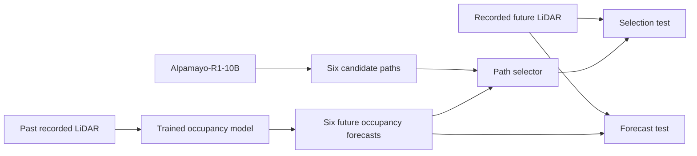
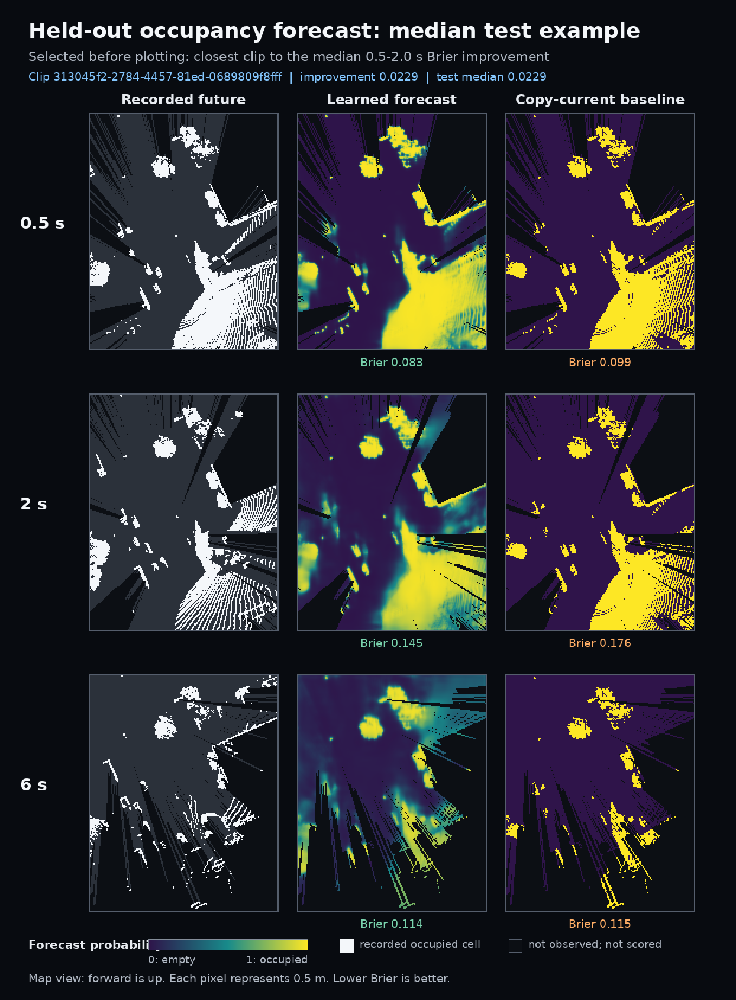

# Alpamayo-R1 Reasoning, Prediction, and Action Study

## Purpose

This project studies Alpamayo-R1 in two connected tests:

1. It measures agreement between the language output and the trajectory output.
2. It tests if a small predictive occupancy model can help evaluate trajectory candidates.

Alpamayo-R1 gives two outputs for each driving scene:

- A Chain of Causation (CoC) explanation
- A 6.4-second trajectory with 64 waypoints

The study compares the driving intent in the CoC with the action in the trajectory. The term `mismatch` identifies a difference between these outputs.

## Test Method

The test uses this sequence:

1. Load the camera data and the ego-motion history.
2. Generate the CoC output.
3. Generate the future trajectory.
4. Classify the intent in the CoC.
5. Classify the action in the trajectory.
6. Compare the two classes.

For example, a CoC can give an instruction to decrease speed. A trajectory that increases speed has a high mismatch score.

### Test Configuration

| Item | Value |
| --- | --- |
| Model | Alpamayo-R1-10B |
| Precision | Native `bfloat16` |
| GPU | One NVIDIA RTX A4500 with 20 GB of memory |
| Dataset | PhysicalAI Autonomous Vehicles test split |
| Evaluation size | 2,000 clips |
| Sample design | 400 clips from each of five time groups |
| Execution | Resumable batches on one GPU |

The clip sampler uses a camera-safe planning timestamp. This limit prevents invalid samples near the limits of the camera data.

## Mismatch Score

The test measures longitudinal intent and lateral intent separately.

### Longitudinal Classes

The CoC parser uses these intent classes:

- `stop`
- `slow_down`
- `maintain`
- `accelerate`

The trajectory classifier uses these action classes:

- `stopped`
- `decelerating`
- `constant_speed`
- `accelerating`

### Lateral Classes

The CoC parser uses these intent classes:

- `hold_lane`
- `nudge_left`
- `nudge_right`
- `lane_change_left`
- `lane_change_right`

The trajectory classifier uses these action classes:

- `straight`
- `shift_left`
- `shift_right`
- `lane_change_left`
- `lane_change_right`

Each axis has a documented compatibility matrix. The mismatch score is `1 - compatibility`.

A score of `0` shows full agreement. A score of `1` shows a contradiction.

## Results

The final run processed all 2,000 clips. The run had no runtime failures.

CI means 95 percent confidence interval.

| Metric | Result |
| --- | ---: |
| Valid clips | 2,000 of 2,000 |
| Mean mismatch | 0.4991, CI 0.4839 to 0.5143 |
| Mismatch standard deviation | 0.3463 |
| Mean average displacement error (ADE) | 1.9391 m, CI 1.8556 m to 2.0226 m |
| ADE standard deviation | 1.9047 m |
| Mean longitudinal match | 0.6125, CI 0.5963 to 0.6288 |
| Mean lateral match | 0.3776, CI 0.3639 to 0.3913 |

### Mismatch Levels

| Level | Score range | Clips | Rate | CI |
| --- | --- | ---: | ---: | ---: |
| Consistent | Less than 0.3 | 531 | 26.55 percent | 24.61 to 28.49 percent |
| Partial | 0.3 to less than 0.6 | 636 | 31.80 percent | 29.76 to 33.84 percent |
| Severe | 0.6 or more | 833 | 41.65 percent | 39.49 to 43.81 percent |

### Difference Between the Two Axes

The mean difference between the longitudinal match and the lateral match is 0.2349. The CI is 0.2131 to 0.2568.

The interval does not include zero. Thus, the two axes have different agreement rates in this test.

### Results for Each Time Group

| Time group | Severe mismatch rate |
| --- | ---: |
| Midday | 38.50 percent |
| Morning | 41.50 percent |
| Afternoon | 42.25 percent |
| Night | 42.75 percent |
| Evening | 43.25 percent |

Each time group has 400 clips. The difference between time groups is smaller than the total severe mismatch rate.

### Frequent Class Pairs

The most frequent longitudinal pairs are:

| CoC intent | Trajectory action | Count |
| --- | --- | ---: |
| `maintain` | `constant_speed` | 540 |
| `maintain` | `accelerating` | 316 |
| `slow_down` | `decelerating` | 204 |
| `slow_down` | `constant_speed` | 171 |

The most frequent lateral pairs are:

| CoC intent | Trajectory action | Count |
| --- | --- | ---: |
| `hold_lane` | `lane_change_right` | 198 |
| `hold_lane` | `lane_change_left` | 175 |
| `hold_lane` | `shift_right` | 160 |
| `hold_lane` | `shift_left` | 157 |
| `hold_lane` | `straight` | 134 |

## Conclusions

The test gives these conclusions:

1. The mean mismatch score is 0.4991 under this test protocol.
2. Severe mismatch occurs in 41.65 percent of the clips.
3. Longitudinal agreement is higher than lateral agreement.
4. The lateral score can include an error from the coordinate representation.

The fourth conclusion is an important limit. A curved road can cause lateral movement in the ego frame without a lane change.

Thus, the current lateral mismatch is an upper estimate. The study does not separate all representation errors from model behavior.

## Limits

The results have these limits:

- The intent classes and the compatibility matrix define the mismatch score.
- The CoC parser can assign an incorrect intent when the text is not clear.
- The lateral classifier uses movement in the ego frame.
- The test uses one model family and one dataset family.
- The test uses one GPU type and one software environment.

The correlation between mismatch and ADE is 0.1234. Thus, mismatch is not a sufficient measure of trajectory quality.

## Recommended Follow-up Tests

### Curvature Correction

Calculate lateral movement relative to a road-following baseline. Then compare the corrected result with the current result.

Use these decision limits:

- A decrease of 10 percentage points or more shows a large representation effect.
- A decrease of less than 5 percentage points shows a small representation effect.

### Parser Test

Apply strict, current, and expanded parsers to the same 2,000 trajectories.

Use these decision limits:

- A difference of more than 5 percentage points shows high parser sensitivity.
- A difference of 2 percentage points or less shows low parser sensitivity.

### Outcome Test

Compare mismatch with ADE after controls for the time group and the speed range.

A persistent ADE difference gives evidence that mismatch relates to trajectory quality. A removed difference gives evidence of classification noise.

### Human Review

Review 200 clips. Use 100 severe `hold_lane` cases and 100 matched control cases.

The review must identify a true contradiction or a representation error for each case. This review can supply labels for metric correction.

## Reproducible Candidate Generation

The file `src/generate_candidates.py` supplies a separate candidate-generation process. This process does not change the completed mismatch experiment.

The default process uses these generation values:

| Item | Value |
| --- | ---: |
| Candidate count | 6 |
| Samples in each rollout | 1 |
| Top-p | 0.98 |
| Temperature | 0.6 |
| Maximum generation length | 256 tokens |

The process pins the model, the dataset, and the Alpamayo source to immutable revisions.

The process calculates a seed from the base seed, clip ID, and planning timestamp. It also calculates and records one seed for each candidate.

The process uses six separate rollouts to make six candidates. This method avoids the device error that occurred in a two-GPU rollout test.

The validated cluster test used one NVIDIA RTX A4500 and CPU offload. The test made six different trajectories for one clip.

Exact numeric results can change with different CUDA hardware or software versions.

### Candidate Output

The process writes one set of files for each completed clip:

| Path | Content |
| --- | --- |
| `artifacts/<key>.npz` | Trajectories, sample times, seeds, text, ground truth, and clip identity |
| `records/<key>.json` | Configuration, metrics, seeds, and the artifact path |
| `manifests/shard-xxxxx-of-yyyyy.jsonl` | Completed records for one shard |

The process writes each file atomically. Each SLURM task writes a separate manifest.

The field `oracle_min_ade_candidate_index` uses ground-truth ADE. This field is only for evaluation and is not a deployment selector.

Use this command to make one metrics file after all shards are complete:

```bash
python src/export_candidate_metrics.py \
  --records-dir results/candidates_k6/records \
  --output results/candidates_k6/candidate_metrics.csv
```

### Environment Setup

Use these commands to create the environment:

```bash
conda env create -f environment.yml
conda activate alpamayo-r1-research
python -m pip install --no-build-isolation -r requirements/flash-attn.txt
python -m pip install --no-deps -r requirements/alpamayo-source.txt
python -m unittest discover -s tests -v
```

The separate installation of `flash-attn` is necessary. The build process requires an installed version of Torch.

### SLURM Operation

Use one visible GPU for each task. Use a zero-based SLURM array to process multiple clips.

Do not use the same shard index and output directory for concurrent tasks.

Use this command for a short test:

```bash
mkdir -p logs
export ALPAMAYO_PYTHON="$CONDA_PREFIX/bin/python"
export PARTITION=<gpu-partition>
NUM_CANDIDATES=1 MAX_CLIPS=1 sbatch --partition="$PARTITION" --array=0-0 \
  --output=logs/%x-%A_%a.out \
  slurm/run_generate_candidates.sh
```

Remove the `NUM_CANDIDATES` and `MAX_CLIPS` values for a full run. Select an array size that is correct for the cluster capacity.

Use `hf auth login` one time before an online run. As an alternative, use the scheduler secret system to supply `HF_TOKEN`.

Set `HF_HUB_OFFLINE=1` only when the cache contains all required files.

The SLURM script checks these conditions before model load:

- The project path is available.
- The clip file is available.
- The Python and package versions are correct.
- The Hugging Face credentials are available for an online run.
- The task has exactly one visible GPU.

The script accepts these optional environment variables:

- `ALPAMAYO_PROJECT_ROOT`
- `CLIP_PARQUET`
- `OUTPUT_DIR`
- `GPU_MEMORY`
- `CPU_MEMORY`

The process resumes only when an existing artifact has the correct configuration and identity. Set `OVERWRITE=1` to replace an incompatible artifact.

## Recorded-Future LiDAR Oracle

The LiDAR oracle is an evaluation tool. It compares each trajectory candidate with LiDAR data from later times.

The tool makes bird's-eye-view (BEV) grids. A BEV grid is a two-dimensional map around the ego vehicle.

The tool does these operations:

1. Correct each LiDAR point for ego motion.
2. Transform each point to the ego frame at the planning timestamp.
3. Make past and future occupancy grids.
4. Move the vehicle footprint along each trajectory candidate.
5. Calculate collision, clearance, observed-space, and out-of-bounds values.
6. Make an evaluation rank for the candidates.

The tool treats unobserved space and out-of-bounds space as unknown. A candidate with unknown exposure ranks after each fully observed, in-bounds candidate.

The oracle is not an interactive simulator. Other road users follow the recorded ego action and do not react to the trajectory candidates.

Read [`docs/lidar_world_oracle.md`](docs/lidar_world_oracle.md) for the coordinate equation, file schema, commands, and limits.

## Predictive Occupancy Extension

### Result in One Sentence

This project trained a small model that predicts future LiDAR occupancy better
than a copy-current baseline. The current path selector did not turn that
forecast improvement into better path choices.

This is a useful engineering result. It shows that the prediction component
works. It also identifies the selection component as the next problem. It does
not show that the vehicle is safer.

### What “World Model” Means in This Project

The term has a narrow meaning here. The model predicts which cells in a map can
contain a LiDAR return in the next 0.5 to 6 seconds.

The model is a 339,910-parameter convolutional network with one convolutional
gated recurrent unit. Training started with random weights. The project did not
load a trained world-model checkpoint. The model is not a general simulator, a
foundation model, an object tracker, or a complete driving system.

The network design uses standard components. The project contribution is the
reproducible data, training, forecast, candidate-scoring, and held-out test
pipeline. The project does not claim a new network architecture or a
state-of-the-art forecast result.

| Part | Source | Use |
| --- | --- | --- |
| Alpamayo-R1-10B | Existing NVIDIA model at a pinned revision | Make six path candidates for each clip |
| PhysicalAI Autonomous Vehicles | Existing NVIDIA dataset at a pinned revision | Supply recorded LiDAR and ego motion |
| Occupancy model | New model in this repository | Predict future occupied map cells |
| Oracle and benchmark | New code in this repository | Build labels and test forecasts and paths |

### Training Data and Method

The experiment used 2,000 recorded driving clips. The upstream dataset calls
its source partition a test split. This project treated the 2,000 selected clips
as a new experiment pool. It then made its own training, validation, and test
sets.

One training example contains these values:

- Three LiDAR maps from 1.0 seconds, 0.5 seconds, and 0 seconds before the plan
- One occupancy channel and one observed-space channel for each past map
- Six target maps from 0.5, 1, 2, 3, 4, and 6 seconds after the plan
- A target mask that excludes cells that the recorded LiDAR did not observe

Each map has 160 by 200 cells. Each cell represents 0.5 m by 0.5 m. The label
builder transforms the recorded future LiDAR into the coordinate frame at the
planning time. These recorded maps supply the training answer. They are not
human labels.

Training compares the predicted probability in each observed cell with the
recorded future value. The optimizer changes the model weights after each
batch. Repeating this process for 30 epochs is what “trained” means here.

The fixed split contains 1,612 training clips, 180 validation clips, and 208
test clips. The split uses the LiDAR source chunk as its unit. No source chunk
occurs in more than one set. This rule prevents nearby clips from the same
source archive from appearing on both sides of the test.

The held-out test path is:



Recorded future LiDAR is available to the training loss for training clips. It
is hidden from the model and the selector for test clips. The evaluation code
uses it only to score an output after the model or selector produces that output.

### Concrete Forecast Output

The figure shows an actual test clip. The script selected the clip closest to
the median short-horizon Brier improvement before it made the figure. This rule
avoids selection of a best-looking example.



White cells in the left column contain recorded future LiDAR endpoints. The
middle column shows the learned occupancy probability. The right column shows
the baseline, which copies the current map into the future. Dark cells were not
observed and do not contribute to the scores.

Use [`tools/render_world_model_example.py`](tools/render_world_model_example.py)
to reproduce the figure from the held-out prediction files.

### How the Forecast Test Works

The baseline asks a simple question: “What if the future map stays equal to the
current map?” A useful predictive model must beat this baseline on clips that
it did not use for training.

The test uses three measures because one measure can hide a bad result. Each
measure has a value from 0 to 1.

| Measure | Plain-language question | Direction |
| --- | --- | --- |
| Average precision | Are the cells that become occupied near the top of the model's ranked list? | Higher is better |
| Intersection over union (IoU) | How much does the predicted occupied area overlap the recorded occupied area? | Higher is better |
| Brier score | How close are the predicted probabilities to the recorded zero-or-one answers? | Lower is better |

For an IoU example, assume that eight occupied cells are correct. Assume that
two predicted cells are extra and two recorded cells are missed. The overlap is
8 cells. The combined area is 12 cells. The IoU is `8 / 12 = 0.67`.

For a Brier example, a 0.9 prediction for an occupied cell has a squared error
of `(0.9 - 1)^2 = 0.01`. A 0.9 prediction for an empty cell has a squared error
of `(0.9 - 0)^2 = 0.81`. The final score is the mean error across observed
cells. This measure penalizes confident, incorrect forecasts.

Average precision checks the full probability ranking. It does not use only one
probability threshold. This is useful because occupied cells are less frequent
than empty cells.

These values are not percentages of correct cells. For example, an average
precision of 0.815 does not mean that 81.5 percent of all cells are correct.

The primary result is the equal-clip mean for 0.5, 1, and 2 seconds:

| Measure | Learned model | Copy-current baseline | Difference | Paired 95 percent interval |
| --- | ---: | ---: | ---: | ---: |
| Average precision | 0.81543 | 0.59847 | +0.21696 | +0.20922 to +0.22485 |
| Brier score | 0.09813 | 0.12401 | -0.02589 | -0.03008 to -0.02189 |
| IoU at a 0.5 threshold | 0.59933 | 0.56072 | +0.03861 | +0.03033 to +0.04664 |

The learned model is better in the required direction for all three measures.
It also beats the baseline at each individual horizon from 0.5 through 6
seconds. All three short-horizon intervals exclude zero in the required
direction.

A paired 95 percent interval shows the range from repeated resampling of source
chunks. A difference is not directionally clear when its interval includes
zero.

These checks support a specific claim: the model learned useful predictive
signal beyond a copy of the current map. They do not prove semantic
understanding, causal prediction, safety, general use outside this dataset, or
state-of-the-art performance. The test compares with one simple baseline, not
with all published occupancy models.

### A Driving Example for Collision Exposure

Assume that Alpamayo gives the vehicle six possible paths. One path continues
straight. One slows down. Other paths move left or right. The selector places a
rectangle with the vehicle's size at points along each path. It then compares
each rectangle with the occupancy map for the same future time.

For example, assume that the vehicle rectangles cover 100 observed map cells
across the sampled future times. Recorded LiDAR endpoints occur in 4 of those
cells. The collision exposure is `4 / 100 = 0.04`.

This value does not mean a 4 percent crash probability. It means that 4 percent
of the checked, observed vehicle-footprint cells overlap recorded LiDAR
endpoints. The test does not identify the object. It does not know if the object
is moving. It does not model braking or reactions from other road users. The
value is a geometric warning signal from a recorded drive.

### Path-Selection Result

The selector used the forecasts to choose one of the six paths. Candidate 0 is
the first stored stochastic rollout and the fixed reference for this test. It
is not a future-data oracle or a claim about Alpamayo's best path. The
recorded-future oracle is a non-deployable reference. It can inspect future
LiDAR before it selects a path.

Average displacement error (ADE) is the mean distance between the selected path
and the recorded vehicle path. A low ADE means that the paths are similar. It
does not by itself mean that a path is safe.

| Policy | Collision exposure | Clips with a recorded conflict | ADE | Out-of-bounds fraction |
| --- | ---: | ---: | ---: | ---: |
| Candidate 0 | 0.03199 | 30.29 percent | 1.8436 m | 0.10096 |
| Learned selection | 0.03868 | 34.13 percent | 2.3110 m | 0.10176 |
| Copy-current selection | 0.04436 | 36.06 percent | 2.3549 m | 0.09535 |
| Recorded-future oracle | 0.01685 | 16.83 percent | 1.7311 m | 0.09135 |

The learned selector was better than the selector that used the copy-current
forecast. It was not better than candidate 0. Its collision-exposure point
estimate was 20.89 percent higher than candidate 0. The paired interval includes
zero. Therefore, the test does not support a reliable exposure difference in
the larger source population. The ADE increase was 0.4673 m, and its paired
interval was 0.1933 m to 0.7699 m.

The selector passed 1 of 5 limits. The forecast passed 3 of 3 limits. The full
benchmark did not pass.

The oracle reduced test exposure from 0.03199 to 0.01685. This is a 47 percent
decrease. The oracle cannot run on a real vehicle because it uses future data.
It shows that useful alternatives exist in the six candidates. The current
selector does not find them reliably.

### What a Finite BEV Map Means

BEV means bird's-eye view. Think of the map as a fixed sheet of graph paper
around the vehicle. It covers 20 m behind the planning position, 80 m in front,
and 40 m on each side.

At highway speed, a vehicle can travel farther than 80 m in 6 seconds. Its
future path then leaves the sheet of graph paper. This does not mean that the
vehicle disappeared or entered free space. It means that the test has no map
cells at that location and cannot score that part of the path.

At 6 seconds, candidate 0 was partly outside the map in 745 of 2,000 clips. In
590 clips, all six candidates had no vehicle-footprint cells inside the map.
The 6-second forecast result uses observed cells that remain in the map. A
long-horizon path-selection claim needs a larger or moving map.

### Why the Numbers Are Credible Within Their Scope

- The test clips share no LiDAR source chunk with the training or validation clips.
- Validation loss selected seed 2027 at epoch 16. Test metrics did not select the checkpoint.
- Two training seeds gave almost equal best validation loss: 0.49441 and 0.49432.
- The learned model beat the baseline on three different measures and at every horizon.
- The intervals use 10,000 paired samples of the 67 held-out source chunks.
- All 2,000 oracle artifacts passed strict identity and shape checks.
- The complete test suite has 122 passing tests.
- The report records source revisions, hashes, split identity, and checkpoint identity.

The intervals describe variation across held-out source chunks. They do not
include the full variation from repeated training. Only two training seeds were
run. This limit is part of the report.

### GPU and SLURM Use

The final run assigned work by task type:

| Stage | Hardware | Work |
| --- | --- | --- |
| LiDAR label and oracle build | Eight concurrent CPU tasks | Transform point clouds and build map labels |
| Training seed 2026 | One NVIDIA RTX A4500 | Train the occupancy model for 30 epochs |
| Training seed 2027 | One NVIDIA RTX A4500 | Train an independent model at the same time |
| Learned test inference | One NVIDIA RTX A4500 | Make 208 held-out probability forecasts |
| Baseline, path score, and statistics | CPUs | Make comparisons and 10,000 bootstrap samples |

The two training jobs used both GPUs on node `ece-nebula10` at the same time.
Each job requested 4 CPUs and 28 GiB of host memory. The jobs took 468 and 469
seconds. The small model trains quickly, so a longer training time would not be
evidence of a better experiment. The pipeline used CPUs for point-cloud and
statistical work that does not benefit from a GPU.

The final run reused the six Alpamayo candidates for each clip. It did not spend
world-model training time to make those 12,000 candidates again. All downstream
jobs ended with exit code 0. Their error logs were empty.

### Engineering Outcome and Next Step

The project produced these reusable parts:

- A recorded-LiDAR label and trajectory-audit pipeline
- A leakage-safe split by source chunk
- A compact multi-horizon occupancy model and resumable trainer
- Authenticated prediction files and checkpoint selection records
- A deployable-input boundary between path selection and future-data evaluation
- Paired uncertainty estimates and machine-readable benchmark results
- SLURM scripts for parallel data work, two-seed GPU training, and evaluation

The next engineering target is the path selector. Calibrate its score scales and
change threshold on validation data. Keep candidate 0 unless the predicted
benefit exceeds that fixed threshold. Reject a change that reduces map coverage.
Increase or recenter the map before a new 6-second selection claim.

The current test set has now been inspected. Freeze the next selector before its
final test. Use a new, untouched source-chunk split for that confirmation.

Read [`reports/world_model_benchmark_2k.json`](reports/world_model_benchmark_2k.json)
for full-precision results and artifact hashes. Read
[`docs/bev_world_model.md`](docs/bev_world_model.md) for the data contract,
commands, metrics, and acceptance limits.

## References

- [Alpamayo-R1 model card](https://huggingface.co/nvidia/Alpamayo-R1-10B)
- [PhysicalAI Autonomous Vehicles dataset](https://huggingface.co/datasets/nvidia/PhysicalAI-Autonomous-Vehicles)
- [Alpamayo source](https://github.com/NVlabs/alpamayo)
