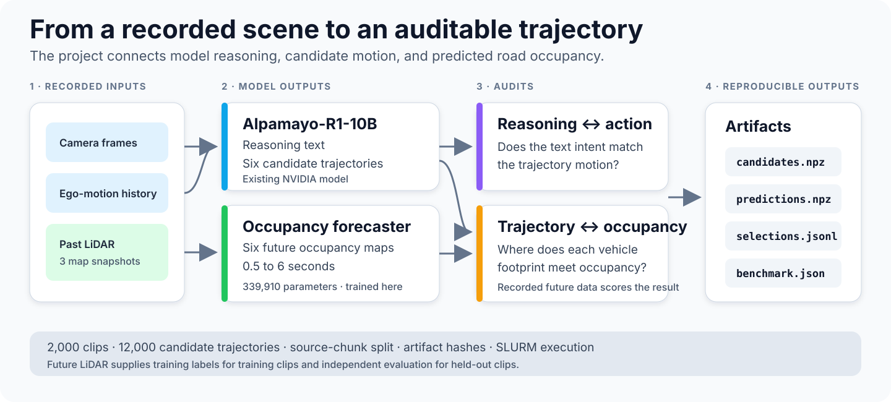

# Alpamayo-R1 Trajectory Audit

This project tests how an autonomous-driving model explains and selects vehicle
motion. It connects three outputs that are usually inspected separately:

- The model's written driving reasoning
- Multiple candidate vehicle trajectories
- A learned forecast of future occupied road space

The result is a reproducible audit pipeline for Alpamayo-R1-10B. It converts
model outputs and recorded LiDAR into traceable artifacts, measurements, and a
machine-readable benchmark report.



## What This Project Does

Alpamayo-R1 receives camera data and ego-motion history. It produces a written
Chain of Causation and a 6.4-second trajectory. A trajectory can look plausible
while it disagrees with the written intent or passes through future occupied
space.

This project answers three concrete questions:

| Question | Method | Output |
| --- | --- | --- |
| Does the explanation match the motion? | Classify the text intent and trajectory action | Reasoning-action mismatch score |
| Can past LiDAR predict future occupied space? | Train a compact occupancy forecaster | Six future probability maps |
| How do candidate paths interact with occupied space? | Place the vehicle footprint along each path | Per-candidate exposure and coverage values |

The occupancy model is a 339,910-parameter convolutional recurrent network.
Training starts with random weights. Recorded future LiDAR supplies the target.
Alpamayo-R1-10B supplies six candidate trajectories for each clip.

The term *world model* has a specific meaning in this repository. It means a
model that predicts future LiDAR occupancy in a fixed bird's-eye-view grid. It
does not mean a general driving simulator.

## Features

- **Reasoning-action audit:** Compare the written driving intent with the motion
  in the generated trajectory.
- **Reproducible candidates:** Generate six seeded Alpamayo trajectories for
  each clip and store their source identity.
- **Future occupancy forecast:** Use three past LiDAR maps to predict six future
  occupancy maps from 0.5 to 6 seconds.
- **Trajectory exposure audit:** Compare each vehicle footprint with predicted
  occupancy. Use recorded occupancy only after selection to score the result.
- **Leakage-safe evaluation:** Keep each LiDAR source chunk in only one of the
  training, validation, or test sets.
- **Traceable artifacts:** Store configuration fingerprints, source revisions,
  file hashes, checkpoint identity, and split identity.
- **Cluster execution:** Run candidate generation, label construction, two-seed
  GPU training, and evaluation through SLURM.

The main outputs are:

| Artifact | Content |
| --- | --- |
| Candidate NPZ | Six trajectories, reasoning text, seeds, and clip identity |
| Occupancy NPZ | Past maps, future labels, observation masks, and geometry |
| Prediction NPZ | Future occupancy probabilities and checkpoint identity |
| Selection JSONL | Selected candidate, component scores, and input hashes |
| Benchmark JSON | Final metrics, intervals, revisions, and artifact hashes |

## Quick Start

Run the small CPU demo before you download a model or dataset:

```bash
python3 -m venv .venv
.venv/bin/python -m pip install -r requirements/demo.txt
.venv/bin/python -m tools.quick_demo
```

The demo creates deterministic moving objects on a small grid. It trains the
same occupancy-network class used by the full project. It then compares the
learned forecast with a baseline that copies the current map into the future.

The command finishes in less than one minute on a typical CPU. It writes a
forecast image and a JSON report to `results/quick_demo/`.

The demo uses generated data so that it needs no credentials, GPU, NVIDIA model,
or driving-dataset download. Use the full runbooks for the 2,000-clip benchmark.

## Results

The complete benchmark processed 2,000 clips and 12,000 candidate trajectories.
All scheduled stages completed without a runtime error.

| Study | Result | Meaning |
| --- | --- | --- |
| Reasoning and action | 41.65 percent of clips had a severe mismatch under the documented class rules | Written intent and generated motion frequently differed |
| Occupancy forecast | The learned model improved all three forecast measures at every tested horizon | Past LiDAR contained useful predictive information beyond a copy of the current map |
| Candidate availability | The recorded-future reference found 47 percent lower mean exposure within the six candidates | The candidate set contained measurable trajectory headroom |
| Candidate selection | Candidate 0 outperformed the tested learned selector | Forecast quality and path-selection quality are separate engineering problems |

The forecast result uses 208 held-out clips from 67 source chunks. The primary
short-horizon comparison is:

| Measure | Learned | Copy-current | Better direction |
| --- | ---: | ---: | --- |
| Average precision | 0.815 | 0.598 | Higher |
| Brier score | 0.098 | 0.124 | Lower |
| Occupancy overlap | 0.599 | 0.561 | Higher |

Average precision checks the probability ranking. Brier score measures
probability error. Occupancy overlap measures the shared predicted and recorded
area. These values are not percentages of correct cells.

Collision exposure is the fraction of observed vehicle-footprint cells that
contain recorded LiDAR endpoints. It is a geometric overlap measure, not a
crash probability.

Read the [benchmark results](docs/benchmark_results.md) for the complete metric
definitions, confidence intervals, path-selection results, map coverage, and
GPU execution record.

## Documentation

| Document | Purpose |
| --- | --- |
| [Benchmark results](docs/benchmark_results.md) | Methods, plain-language metric definitions, exact results, and interpretation |
| [Candidate generation](docs/candidate_generation.md) | Alpamayo setup, output format, and SLURM commands |
| [Occupancy forecasting](docs/bev_world_model.md) | Data contract, training, evaluation, and benchmark submission |
| [LiDAR oracle](docs/lidar_world_oracle.md) | Coordinate transforms, occupancy construction, and trajectory exposure |
| [Machine-readable report](reports/world_model_benchmark_2k.json) | Full-precision values, immutable revisions, and artifact hashes |

The benchmark uses the
[NVIDIA Alpamayo-R1-10B model](https://huggingface.co/nvidia/Alpamayo-R1-10B),
the [PhysicalAI Autonomous Vehicles dataset](https://huggingface.co/datasets/nvidia/PhysicalAI-Autonomous-Vehicles),
and the [NVlabs Alpamayo source](https://github.com/NVlabs/alpamayo).
